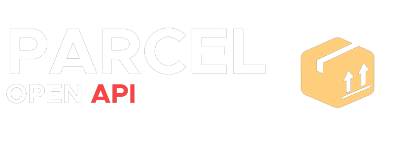

# About
Parcel SDK on ROBLOX

The Parcel OpenAPI Wrapper makes it easy for developers to interact with our ROBLOX Hub

- Simple and easy to use
- Most coverage of the Parcel API

With that its now been brought to Luau.

# Install

*with Roblox Marketplace*

https://www.roblox.com/library/9603462189/Parcel

*with GitHub*

https://github.com/noahdoespython/ParcelSDK/releases

# Usage

First you will need to create a Parcel object


```lua
local Parcel = require(path/to/parcel)
```

Then, you may now use these features!

__**CheckProductWhitelist**__

`self.CheckProductWhitelist({hubID : string, productID : string, robloxID: string})`

```lua
local Parcel = require(path/to/parcel)

Parcel.CheckProductWhitelist('0000','hfh34th9uh9h9u2h9u3h9u2h9',"111111111")

```

**AddUserToWhitelist**

`self.AddUserToWhitelist({hub_secret_key : string, productID : string, robloxID: string})`

```lua
local Parcel = require(path/to/parcel)

Parcel.AddUserToWhitelist('5yu94589h93h589h8935',"nr4hhfh94hf94h94h89yh5","1111")
```

**GetProductsList**

`self.GetProductsList({hubSecretKey : string})`

```lua
local Parcel = require(path/to/parcel)

Parcel.AddUserToWhitelist('5yu94589h93h589h8935',"nr4hhfh94hf94h94h89yh5","1111")
```
**GetSpecificProducts**

`self.GetSpecificProducts({robloxID: string, hubSecretKey : string})`

```lua
local Parcel = require(path/to/parcel)

Parcel.GetSpecificProducts("111111111","5yu94589h93h589h8935")
```

**GetProductsList**

`self.GetProductsList({hubSecretKey : string})`

```lua
local Parcel = require(path/to/parcel)

Parcel.GetProductsList('gk1590fg29hc4qdkx56ul5qwzbvlam2kyf8mwwfa9i')
```


